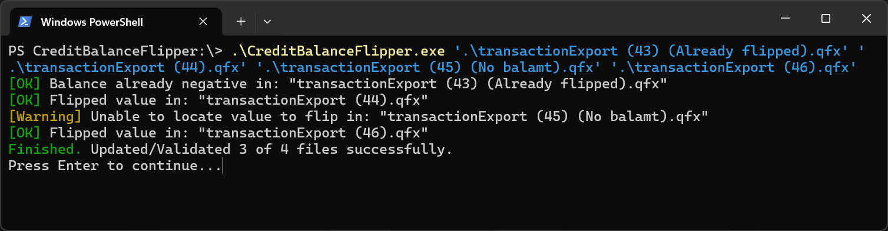

# QFXCreditBalanceFlipper
<html>
    <div style="display: flex; padding-bottom: 1rem;">
        
        <div>
            <p>
                CreditBalanceFlipper flips the credit balance found in QFX files to be negative.
                This can be useful when trying to avoid financial apps such as Quicken misinterpreting the value.
            </p>
            <p>
                The module can be called via the command line, or by dragging
                and dropping one or multiple files onto the executable.
            </p>
        </div>
    </div>
</html>

## Usage Guides
- [Drag & Drop](#drag--drop)
- [Command line (CLI)](#cli-usage)
    + [Arguments](#arguments)
    + [Flags](#flags)

## Download
**Executable (Windows):** Get the latest release from the [releases tab](https://github.com/theCYBRIX/QFXCreditBalanceFlipper/releases).  
**Python:** Download and use [credit_balance_flipper.py](credit_balance_flipper.py). It works stand-alone.

## Drag & Drop

Dragging files onto the executable (or a shortcut to the executable) is the most straight-forward way of using it.  
***The application will update/overwrite the existing files in place.*** If you want to keep a backup of the original, be sure to make a copy on which to make the changes.

If all files could be processed without error, the application will close automatically when finished:


Otherwise, if any errors occur, the application will wait for user input, giving an opportunity to look at what went wrong:


## CLI Usage

Example command line usage:
```cmd
.\CreditBalanceFlipper.exe ".\\transactions.qfx" ".\\transactions(1).qfx" --pause
```

If any errors occur, the application will pause and wait for user input before exiting:



### Arguments:
```text
    file_path... (str): The path/s to the .qfx file/s to process.
```
### Flags:
```text
    -p, --pause     Wait for user input before exiting
    -u, --undo      Make credit balance positive in the specified files
    -h, --help      Show help message and exit without processing files
```